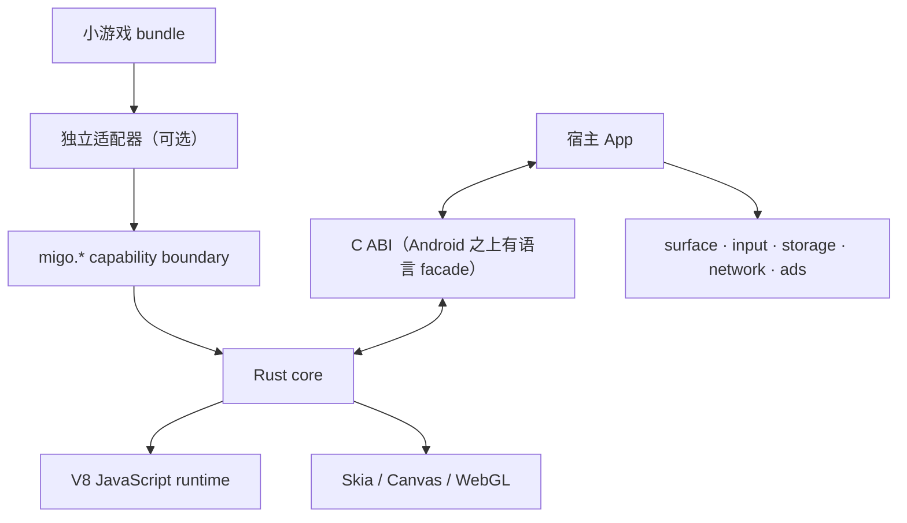
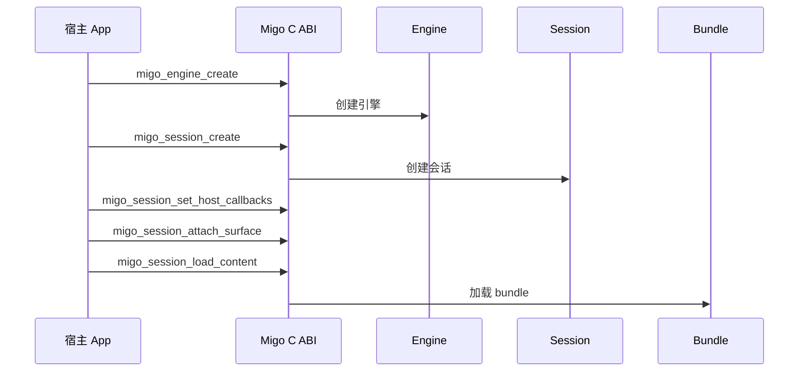
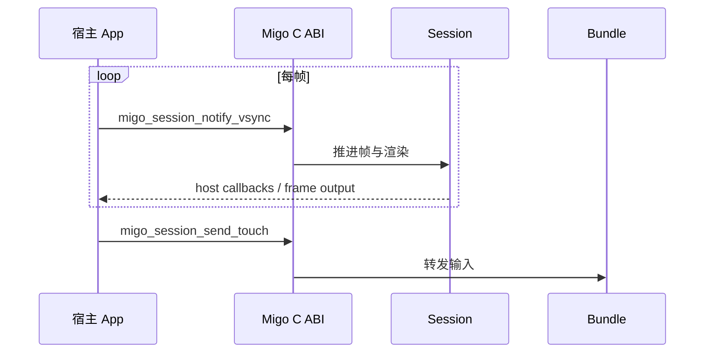
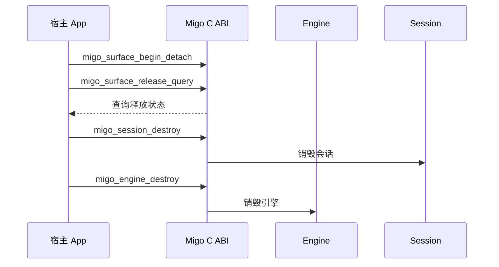

Migo 是可嵌入的 Canvas/WebGL 小游戏运行容器。`migo.*` 是引擎安装给内容的唯一能力
表面；微信和 Web 适配器（例如 `migo-wx-adapter`、`migo-web-adapter`）属于独立仓库，
不是引擎内置模块。Migo 没有 DOM 或 CSS，也不应被描述为通用 WebView 替代品。

## 组件拓扑

### 文字说明

1. 小游戏 bundle 只通过 `migo.*` 能力边界访问运行时能力；可选的独立适配器位于引擎之外。
2. Rust core 编排 V8 JavaScript runtime 与 Skia 渲染后端，输出 Canvas/WebGL 内容。
3. 宿主 App 通过 C ABI 创建和管理会话 — 这是四个平台唯一共有的事实接口;Android 侧惯用的 Java facade(`MigoRuntime`/`MigoGameView`)只是这层 ABI 之上的语言包装。surface、input、storage、network、ads 等服务由宿主自行提供。
4. Migo 不提供 DOM、CSS、页面布局或浏览器文档对象模型。

## 会话生命周期

图上只写函数名；完整签名按所属头文件去 [Session](/docs/0.9/reference/session/)、[Surface](/docs/0.9/reference/surface/) 各页查。

### 初始化

### 文字说明

1. 宿主先调用 `migo_engine_create`，再调用 `migo_session_create` 获取会话句柄。
2. 会话建立后安装 `migo_session_set_host_callbacks`，再用 `migo_session_attach_surface` 提供渲染目标。
3. `migo_session_load_content` 加载内容 bundle，只此一次（二次调用返回 `MIGO_ERROR_INVALID_STATE`）。

### 每帧与输入

### 文字说明

1. 宿主按显示系统节奏调用 `migo_session_notify_vsync` 推进帧（仅在收到 `on_request_frame` 后）。
2. 触摸事件通过 `migo_session_send_touch` 进入内容输入流；其他输入类型使用 input.h 中对应的 `migo_session_send_*` 接口。

### 释放

### 文字说明

1. surface 丢失时先调用 `migo_surface_begin_detach`，再用 `migo_surface_release_query` 等待释放状态。
2. 释放完成后按拥有关系销毁会话和引擎；销毁返回 `MIGO_OK` 后句柄立即失效。

## 平台边界

* **Android、Linux、Windows**：使用 V8；宿主分别通过 Android facade 或可链接的 C ABI 运行时接入。
* **HarmonyOS NEXT**：由于 HarmonyOS 5.0.0(12) 起匿名内存执行权限限制，Migo 使用 `jitless` 模式运行 V8；不要宣称 NEXT 上的 JIT 性能。
* **Apple**：外部 frame 会话使用 `CAMetalLayer`；实现尚未完成生产发布验证，因此不应据此作出生产性能声明。

Migo 的构建流程和平台依赖见仓库的 [`BUILD.md`](https://github.com/minigame-labs/migo-runtime/blob/HEAD/BUILD.md)。
