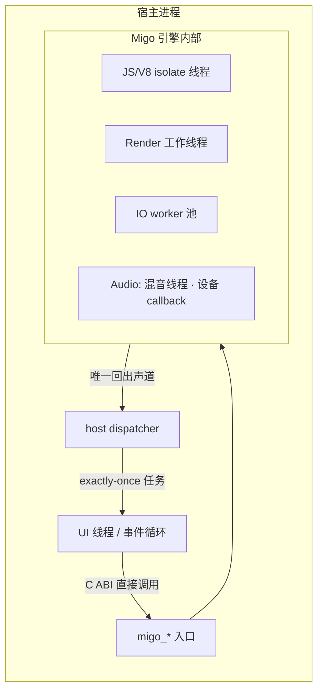

Migo 引擎内部有自己的工作线程，但这条 ABI 上宿主需要负责的并发事实只有几件：**哪些入口线程安全、哪些句柄你要自己串行化、dispatcher 如何接收任务、回调落在哪条执行上下文**。本页只讲这四件事；各平台把这些映射成什么线程设施见每节末尾的表。

## 内部线程模型：看得见结果，看不见线程



### 文字说明

1. 引擎在工作线程上跑 JS、渲染、IO 与音频；这些线程由引擎创建、销毁，宿主永远不直接与之交互。
2. 宿主对入口函数 `migo_*` 的调用走 C ABI — 调用线程由下面的表约束。
3. 引擎回到宿主代码的唯一通道是 **dispatcher**：引擎把一个任务（task）交给宿主的 dispatcher，后者决定在哪条执行上下文里跑。
4. 引擎从不把自己的锁借给宿主线程——dispatcher 和回调执行时，不持有任何 engine/session/attachment 锁。

音频的设备 callback 被刻意隔离开：硬件拉数据的线程不与宿主或 JS 交接，延迟与节奏由这条隔离保证。这条线程不在 ABI 上暴露任何句柄，宿主编不到它。

## 句柄并发表

四种句柄横跨这条 ABI，规则**各不相同**；把一种的规则套到另一种上是这条 ABI 最常见的内存安全错误来源。

| 句柄 | 唯一性 | 并发规则 | 销毁 |
| --- | --- | --- | --- |
| `MigoEngine*` | 唯一，宿主持有 | 入口线程安全；宿主自己的多线程调用由宿主串行化 | `migo_engine_destroy`，且要在所有子 Session 销毁之后；成功返回是最终的线程汇合点 |
| `MigoSession*` | 唯一，宿主持有 | **同一 Session 的调用必须串行** | `migo_session_destroy` 消费句柄、取消已排队回调；attachment 存活 / release 待决时会拒绝（`MIGO_ERROR_INVALID_STATE`） |
| `MigoSurfaceAttachment*` | 唯一，禁止别名 | 与其 Session 串行；同时只有一个 active | 只能由 `migo_surface_begin_detach` 消费 |
| `MigoSurfaceRelease*` | 唯一，宿主持有 | 可从任何宿主串行化的线程查询；不持有资源租约 | `migo_surface_release_destroy`，且只在 `RELEASED` 之后 |

两个容易记错的细节：

- **`RELEASED` 的 release observer 可以比 Session 活得久。** Session 销毁被拒绝的条件是 observer 仍 pending；一旦到 `RELEASED`，先销毁 Session 再回头 query/destroy observer 都是良定义的。除此之外没有第二种跨代生存：子句柄永远不能比父句柄活得久。
- **`dispatcher_data` 不是句柄。** 它在安装回调时被引擎拷贝，之后每次派发原样传回。因为回调配置每个 Session 只能装一次，不存在排队任务引用着旧 `user_data` 时数据被替换的窗口——所以它不需要自己的生命周期协议，只需保证在所属 Session 销毁前保持有效。

## Dispatcher 契约

```c
typedef MigoResult(MIGO_CALL *MigoDispatchFn)(void *dispatcher_context,
                                              MigoTaskFn task,
                                              void *task_context);
```

规则按后果排序：

1. **返回 `MIGO_OK` = 承诺任务被恰好调用一次**——inline 或稍后皆可。返回任何错误值，任务所有权回到 Migo，被丢弃并记日志。拒绝任务就请返回 `MIGO_ERROR_DISPATCH_REJECTED`，让日志说人话。
2. **dispatcher 必须线程安全且快速返回。** 引擎会从它的工作线程（render/JS/IO）进入它；返回慢等于拖慢引擎关键路径。正确形态是把任务推入宿主自己的队列立刻返回。
3. **inline 派发是显式选择：** 一个"收到任务就地调用"的 dispatcher 选择在**引擎 worker 线程上**跑回调；一个 UI dispatcher 通常把任务排到自家事件循环。两者都合法，后果自己担。
4. **回调配置每个 Session 只能安装一次**，且必须先于首次 surface attach、先于 `set_lifecycle(RUNNING)`；之后再装得 `MIGO_ERROR_INVALID_STATE`。这条一次性规则消灭了"旧回调指针被替换时、队列里还排着指向它的任务"的整类竞态。
5. **任一个非空用户回调都要求非空 dispatcher**；回调从不带 Migo 锁执行。

回调里允许做什么：可以**重入** lifecycle、visibility、focus、detach、destroy —— 回调执行时不持 Migo 锁，重入是良定义的。重入 destroy 有专门语义：Session 立即失效，只允许当前回调栈自然收尾。

## 两个异步形状，两种等法

ABI v1 只有两个异步操作，形状刻意不同：

| | 上锁级别 | 订恰作用 | 取消 | 迟到完成 |
| --- | --- | --- | --- | --- |
| `migo_session_load_content` | 无——结果通过 `on_ready`/`on_error` 上报 | 每个 Session 至多一次未完成 | `migo_session_destroy` 即取消 | 销毁前入队的完成永远不在销毁后运行 |
| surface release | `migo_surface_release_query` 是权威读数 | 可多实例 | 不可取消（`begin_detach` 返回 `MIGO_OK` 时已不可逆） | 级别触发：先查先答，不丢边沿 |

`on_surface_released` 回调只是可选的 **edge 唤醒**：被拒、被取消、被延迟派发都不改变 release 状态。别拿回调当"可以释放窗口"的证明——唯一的权威是 query，宿主应该在销毁 native 资源前查它。

## 销毁 = 最终的线程汇合点

- `migo_session_destroy` 请求 Host 关停，并把正在退出的工作线程**移交 Engine**；它不把自己的调用栈 join 进回调。
- `migo_engine_destroy` 是最后的屏障：成功返回时所有由 Session 移交的引擎线程已汇合，不持任何 engine/session/attachment/callback/retirement 锁。此后才允许销毁平台窗口资源、卸载 Migo 库。
- 在引擎自己的线程上调 `engine_destroy` 会得 `MIGO_ERROR_INVALID_STATE` 且不消费句柄——从另一条线程等回调栈收尾后重试。

## 平台映射速查

| 平台 | dispatcher 的惯用落点 | 备注 |
| --- | --- | --- |
| Android | `Handler`/`Looper`（主线程或专用 HandlerThread） | NativeActivity 无 Java 层的宿主以 C 实现同等语义 |
| Linux | GLib main loop / 自有事件循环 | X11/Wayland 的连接纪律见 surface 页 |
| Windows | 消息循环 / `PostMessage` | Win32 `HWND` 宿主拥有消息循环 |
| OpenHarmony | ArkUI 宿主事件循环 | 静态库宿主链接进自家 `.so` |
| iOS/macOS | 主队列（GCD） | Apple 产品走 WebKit 宿主路径，回调仍经文 ABI |

## 常见反模式

- **在 dispatcher 里做重活或直接处理帧逻辑**：dispatcher 是分类器不是 runtime 线程，阻塞它会堵住引擎工作线程。
- **从回调里同步等宿主线程答案**：回调在引擎选的执行上下文跑，跨线程等答案就是制造死锁候选；异步的问题用异步接下去。
- **把"回调没到"当状态**：surface release 是级别不是边沿，`load_content` 被取消时可能没有 on_error ——权威读数该在哪张表，用哪张表。
- **多线程同时调同一 Session 的入口**：发表里 Session 行是串行的，靠 OS 同时调度两个线程调它属于宿主 bug。

读本页后还想顺一遍状态机的人，下一步读 [会话生命周期](/docs/concepts/lifecycle/) 的销毁部分；C ABI 的函数级签名按 [Session](/docs/reference/session/) 与 [Surface](/docs/reference/surface/) 页查。
