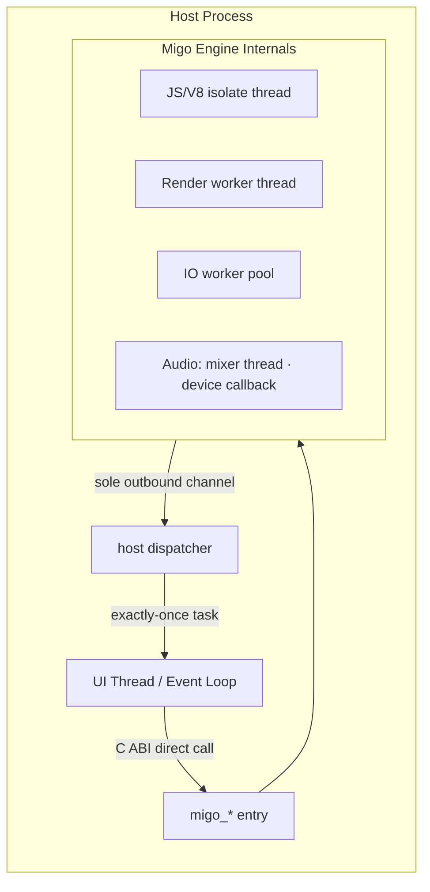

Migo maintains its own internal worker threads, but the concurrency facts the host is responsible for on this ABI are few: **which entry points are thread-safe, which handles the host must serialize, how the dispatcher receives tasks, and which execution context callbacks land on.** This page covers exactly those four points; platform-specific mappings appear in the table at the end of each section.

## Internal Thread Model: See the Results, Not the Threads



### Plain-text equivalent

1. The engine runs JS, rendering, IO, and audio on worker threads; these threads are created and destroyed by the engine and the host never interacts with them directly.
2. The host's calls to `migo_*` entry points go through the C ABI — the calling thread is constrained by the tables below.
3. The engine's sole channel back to host code is the **dispatcher**: the engine delivers a task to the host's dispatcher, which decides on which execution context to run it.
4. The engine never holds its own locks while in host code — the dispatcher and callbacks execute without holding any engine, session, or attachment lock.

The audio device callback is deliberately isolated: the hardware data-pull thread has no hand-off with the host or JS threads; latency and cadence are guaranteed by that isolation. This thread exposes no handle on the ABI — the host cannot reach it.

## Handle Concurrency Table

Four handle types span this ABI, each with **different rules**; applying one handle's rules to another is the most common source of memory-safety bugs on this ABI.

| Handle | Ownership | Concurrency Rule | Destruction |
| --- | --- | --- | --- |
| `MigoEngine*` | Unique, host-owned | Entry points are thread-safe; concurrent host calls are serialized by the host | `migo_engine_destroy`, after all child Sessions are destroyed; a successful return is the final thread rendezvous point |
| `MigoSession*` | Unique, host-owned | **Calls on the same Session must be serialized** | `migo_session_destroy` consumes the handle and cancels queued callbacks; rejected (`MIGO_ERROR_INVALID_STATE`) while an attachment is live or a release is pending |
| `MigoSurfaceAttachment*` | Unique, no aliasing | Serialized with its Session; at most one active at a time | Consumed only by `migo_surface_begin_detach` |
| `MigoSurfaceRelease*` | Unique, host-owned | May be queried from any host-serialized thread; holds no resource lease | `migo_surface_release_destroy`, only after `RELEASED` |

Two details that are easy to get wrong:

* **A `RELEASED` release observer may outlive its Session.** Session destruction is rejected only while the observer is still pending; once `RELEASED`, destroying the Session first and then querying or destroying the observer is well-defined. No other cross-generational survival applies — child handles must never outlive their parent.
* **`dispatcher_data` is not a handle.** It is copied by the engine at callback-installation time and returned unchanged on every dispatch. Because callback configuration can only be installed once per Session, there is no window where queued tasks reference a stale `user_data` while the data is replaced — it requires no lifetime protocol of its own, only validity through the owning Session's destruction.

## Dispatcher Contract

```c
typedef MigoResult(MIGO_CALL *MigoDispatchFn)(void *dispatcher_context,
                                              MigoTaskFn task,
                                              void *task_context);
```

Rules ordered by consequence:

1. **Returning `MIGO_OK` is a promise that the task will be called exactly once** — inline or deferred. Returning any error value transfers task ownership back to Migo; the task is discarded and logged. When rejecting, return `MIGO_ERROR_DISPATCH_REJECTED` so the log message is human-readable.
2. **The dispatcher must be thread-safe and return quickly.** The engine enters it from its worker threads (render/JS/IO); a slow return directly stalls the engine's critical path. The correct form is to push the task onto the host's own queue and return immediately.
3. **Inline dispatch is an explicit choice:** a dispatcher that calls the task in place runs the callback **on the engine's worker thread**; a UI dispatcher typically queues the task onto its own event loop. Both are legal; own the consequences.
4. **Callback configuration may be installed exactly once per Session**, and must precede the first surface attach and `set_lifecycle(RUNNING)`; installing it afterward returns `MIGO_ERROR_INVALID_STATE`. This one-shot rule eliminates the entire class of races where queued tasks point to a stale callback pointer.
5. **Any non-null user callback requires a non-null dispatcher**; callbacks never execute while holding a Migo lock.

What is allowed inside callbacks: **re-entering** lifecycle, visibility, focus, detach, and destroy is permitted — no Migo lock is held during callback execution, so re-entry is well-defined. Re-entering destroy has specific semantics: the Session is immediately invalidated and only the current callback stack is allowed to unwind naturally.

## Two Async Shapes, Two Wait Patterns

ABI v1 has exactly two async operations, each with a deliberately different shape:

| | Lock level | Intended cardinality | Cancellation | Late completion |
| --- | --- | --- | --- | --- |
| `migo_session_load_content` | None — result delivered via `on_ready`/`on_error` | At most one outstanding per Session | `migo_session_destroy` cancels it | Completions queued before destroy never run after destroy |
| surface release | `migo_surface_release_query` is the authoritative read | Multiple instances allowed | Not cancellable (`begin_detach` returning `MIGO_OK` is irreversible) | Level-triggered: query first, no edge loss |

The `on_surface_released` callback is only an optional **edge wake-up**: rejection, cancellation, or delayed dispatch do not alter the release state. Do not treat the callback as proof that the window may be released — the only authority is the query; the host must query before destroying native resources.

## Destroy = Final Thread Rendezvous Point

* `migo_session_destroy` requests host shutdown and **transfers** exiting worker threads to the Engine; it does not join its own call stack into callbacks.
* `migo_engine_destroy` is the final barrier: on successful return, all engine threads transferred from Sessions have joined and no engine, session, attachment, callback, or retirement lock is held. Only after this point is it safe to destroy platform window resources and unload the Migo library.
* Calling `engine_destroy` from one of the engine's own threads returns `MIGO_ERROR_INVALID_STATE` without consuming the handle — wait on a different thread for the callback stack to unwind, then retry.

## Platform Mapping Quick Reference

| Platform | Typical dispatcher target | Notes |
| --- | --- | --- |
| Android | `Handler`/`Looper` (main thread or dedicated HandlerThread) | NativeActivity hosts without a Java layer implement equivalent semantics in C |
| Linux | GLib main loop / custom event loop | X11/Wayland connection discipline described on the surface page |
| Windows | Message loop / `PostMessage` | Win32 `HWND` host owns the message loop |
| OpenHarmony | ArkUI host event loop | Static-library host links into its own `.so` |
| iOS/macOS | Main queue (GCD) | Apple products take the WebKit host path; callbacks still go through this ABI |

## Common Anti-patterns

* **Doing heavy work or frame processing inside the dispatcher**: the dispatcher is a classifier, not a runtime thread; blocking it stalls the engine's worker threads.
* **Synchronously waiting on the host thread from inside a callback**: the callback runs on the engine-chosen execution context; blocking across threads is a deadlock candidate — continue async work asynchronously.
* **Treating 'callback not yet received' as state**: surface release is level-triggered, not edge-triggered; a cancelled `load_content` may produce no `on_error` — consult the authoritative source in the table, not the callback.
* **Calling the same Session's entry points concurrently from multiple threads**: the Session row in the table is serialized; relying on the OS to schedule two threads calling it simultaneously is a host bug.

After reading this page, if you want to walk through the state machine, continue with the destroy section of [Session Lifecycle](/docs/en/0.9/concepts/lifecycle/); for function-level C ABI signatures, see the [Session](/docs/en/0.9/reference/session/) and [Surface](/docs/en/0.9/reference/surface/) reference pages.
