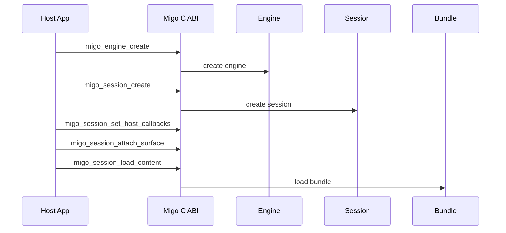
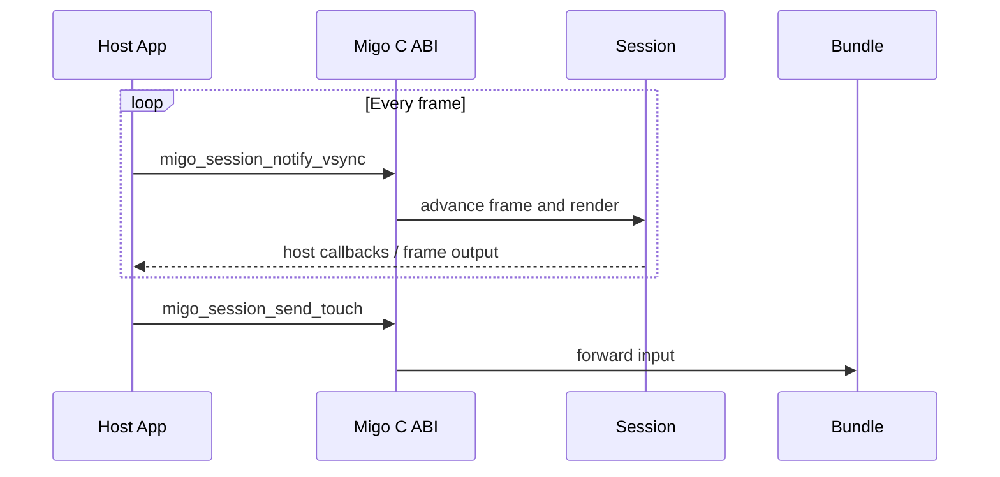
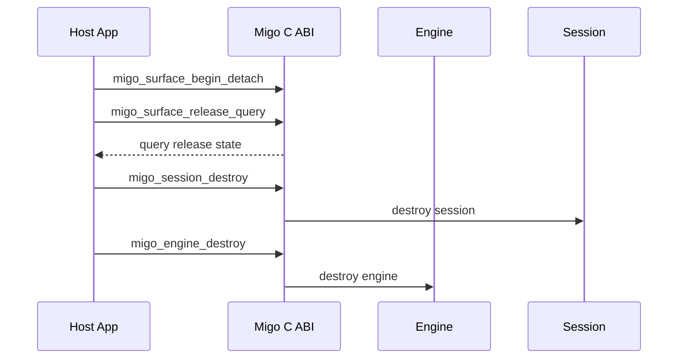

Migo is an embeddable Canvas/WebGL mini-game runtime container. `migo.*` is the sole capability surface the engine installs for content; adapters such as `migo-wx-adapter` and `migo-web-adapter` live in separate repositories and are not built-in engine modules. Migo has no DOM or CSS and must not be described as a general-purpose WebView replacement.

## Component Topology

```mermaid
flowchart TB
  Bundle[Mini-game bundle] --> Adapter[Standalone adapter (optional)]
  Adapter --> Boundary[migo.* capability boundary]
  Boundary --> Core[Rust core]
  Core --> V8[V8 JavaScript runtime]
  Core --> Render[Skia / Canvas / WebGL]
  Host[Host App] <--> SDK[C ABI (language facade above Android)]
  SDK <--> Core
  Host --> Services[surface · input · storage · network · ads]
```

### Plain-text equivalent

1. The mini-game bundle accesses runtime capabilities exclusively through the `migo.*` capability boundary; optional standalone adapters live outside the engine.
2. The Rust core orchestrates the V8 JavaScript runtime and the Skia rendering back-end, producing Canvas/WebGL content.
3. The host app creates and manages sessions through the C ABI — the one interface shared by all four platforms; the Java facade (`MigoRuntime`/`MigoGameView`) conventionally used on Android is only a language wrapper above this ABI layer. Services such as surface, input, storage, network, and ads are provided by the host.
4. Migo provides no DOM, CSS, page layout, or browser document object model.

## Session Lifecycle

Diagrams show function names only; full signatures are in the [Session](/docs/reference/session/) and [Surface](/docs/reference/surface/) reference pages.

### Initialization



### Plain-text equivalent

1. The host calls `migo_engine_create` first, then `migo_session_create` to obtain a session handle.
2. After the session is created, install `migo_session_set_host_callbacks`, then supply a render target with `migo_session_attach_surface`.
3. `migo_session_load_content` loads the content bundle exactly once; a second call returns `MIGO_ERROR_INVALID_STATE`.

### Per-frame and Input



### Plain-text equivalent

1. The host calls `migo_session_notify_vsync` at the display system's cadence to advance frames; only after receiving `on_request_frame`.
2. Touch events enter the content input stream via `migo_session_send_touch`; other input types use the corresponding `migo_session_send_*` interfaces in input.h.

### Teardown



### Plain-text equivalent

1. When a surface is lost, call `migo_surface_begin_detach` first, then poll with `migo_surface_release_query` until the release state is complete.
2. Once released, destroy the session and engine in ownership order; the handle is invalid immediately after destroy returns `MIGO_OK`.

## Platform Boundaries

- **Android, Linux, Windows**: use V8; the host integrates through the Android facade or the linkable C ABI runtime.
- **HarmonyOS NEXT**: due to anonymous-memory execution restrictions introduced in HarmonyOS 5.0.0 (12), Migo runs V8 in `jitless` mode; do not claim JIT-level performance on NEXT.
- **Apple**: external-frame sessions use `CAMetalLayer`; the implementation has not completed production-readiness verification, so production performance claims must not be made.

Migo's build process and platform dependencies are documented in the repository's [`BUILD.md`](https://github.com/minigame-labs/migo-runtime/blob/HEAD/BUILD.md).
