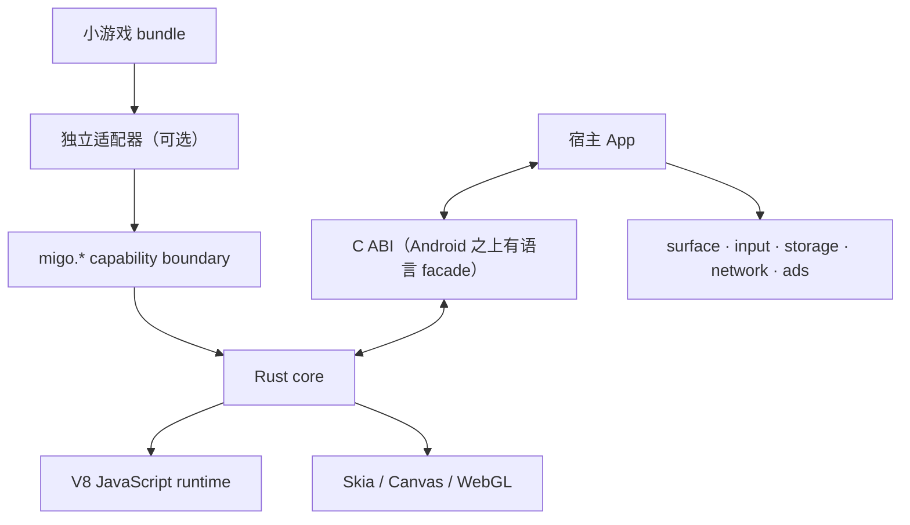

  

    可嵌入的 Canvas/WebGL 小游戏运行时,同一份 C ABI 跨 Android、Linux、Windows、OpenHarmony
  

  

    <a class="hh-btn hh-btn-primary" href="/docs/getting-started/android/">快速开始 →</a>
    <a class="hh-btn hh-btn-secondary" href="/docs/reference/overview/">C ABI 参考</a>
  

Migo 是可嵌入的 Canvas/WebGL 小游戏运行容器。宿主 App 提供 surface、输入与存储,Migo 提供
V8 JavaScript 运行时与 Skia 渲染管线,跨 Android、Linux、Windows 及 OpenHarmony 四个平台。没
有 DOM 或 CSS——不是通用 WebView 替代品。

1. 小游戏 bundle 只通过 `migo.*` 能力边界访问运行时能力;可选的独立适配器位于引擎之外。
2. Rust core 编排 V8 JavaScript runtime 与 Skia 渲染后端,输出 Canvas/WebGL 内容。
3. 宿主 App 通过 C ABI 创建和管理会话 — 四个平台唯一共有的事实接口;Android 侧惯用的 Java facade(MigoRuntime/MigoGameView)只是这层 ABI 之上的语言包装。surface、input、storage、network、ads 等服务由宿主自行提供。
4. Migo 不提供 DOM、CSS、页面布局或浏览器文档对象模型。

## API 参考一览

C ABI 由 8 个头文件组成,跨四个平台接口一致,`abi_version` 协商。按头文件逐页:

| 页面 | 一句话 |
| --- | --- |
| [C ABI 总览](/docs/reference/overview/) | 头文件关系、调用顺序、句柄模型、错误码与编译期选型 |
| [基础类型与导出宏](/docs/reference/types/) | 句柄/错误码/导出宏,`MIGO_ABI_*` 常量与 `struct_size` 演进规则 |
| [Engine 初始化](/docs/reference/engine/) | `migo_engine_*` 生命周期:创建、ICU 数据、销毁线程完成屏障 |
| [Session](/docs/reference/session/) | 会话句柄、`MigoHostCallbacks`、dispatch 派发器与销毁顺序 |
| [Surface 接入](/docs/reference/surface/) | `migo_surface_attach`、平台 descriptor、`frame_info` 与背压 |
| [输入事件](/docs/reference/input/) | `migo_session_send_*` 系列:校验、FIFO、坐标单位与各事件载荷 |
| [外部帧注入](/docs/reference/external-frames/) | readPixels/getImageData 兼容路径、ingress/sync-barrier/resource 三 lane |
| [运行库能力查询](/docs/reference/capabilities/) | `migo_query_capabilities`:ABI 版本区间与平台位掩码的运行时查询 |

语义细节(架构、生命周期、线程模型)见[核心概念区](/docs/concepts/sdk-architecture/)。

## 快速上手

:::note[上手路径]

1. **[Android 快速开始](/docs/getting-started/android/)** — 9 步从下载 AAR 到 bundle 点亮(其他平台指南将随平台产物成熟按一平台一页并入);
2. [下载与校验](/docs/release/download-verification/) — 发布产物的获取、指纹校验与首次部署前的最小验证集。

:::
